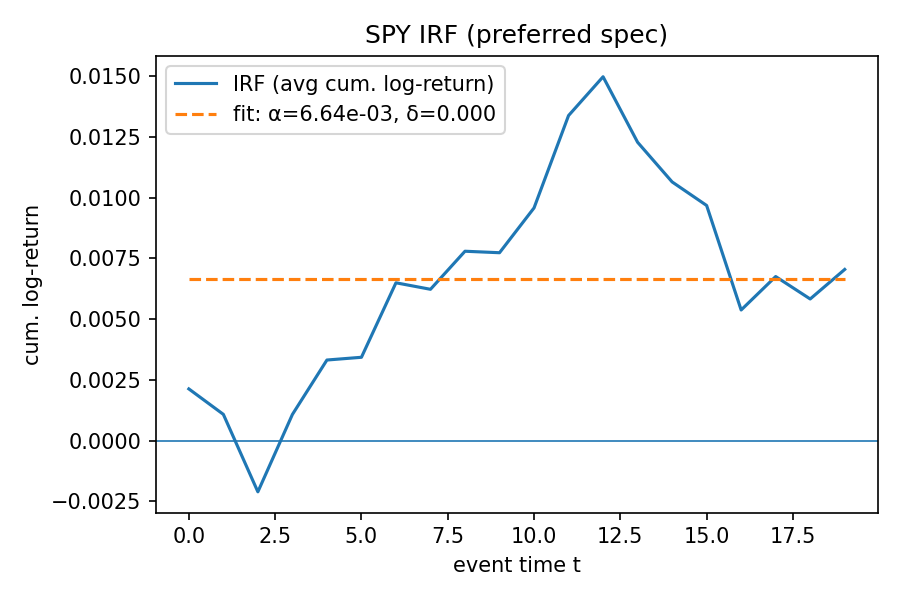

# Discussion & Results

*Generated on 2025-08-09 from 2018-01-02 → 2025-07-29 data.*

## Executive summary

- MSFT shows short-lived follow-through after activity spikes (**baseline half-life ≈ 3.01d**); others exhibit **no forward drift** (δ≈0).
- For SPY, IRFs indicate contemporaneous jumps only (α=52.6 bp).
- For ETH, IRFs also point to same-day effects only (α=-118.1 bp).
- ETH same-day regression: Δfees_t → r_t has a **positive** slope (coef=13.5 bp, p=0.223, R²=0.001).

## Baseline predictive regressions (next-day returns)

We estimate OLS models of next-day returns on activity deltas with rate controls and AR(1). Overall, **predictive power is weak**, consistent with prices reacting contemporaneously to activity shocks.

- **SPY** (act+rates+ar): 1 vars at p<0.05 (1 at p<0.10); top |t|: d_spy_earnings (coef=-217.4 bp, p=0.048).
- **MSFT** (act+rates+ar): 2 vars at p<0.05 (3 at p<0.10); top |t|: msft_earnings_lag1 (coef=-5.7 bp, p=0.048).
- **ETH** (act+rates+ar): 0 vars at p<0.05 (0 at p<0.10); top |t|: oil_consumption_lag1 (coef=-0.0 bp, p=0.128).
- **OIL** (act+rates+ar): 0 vars at p<0.05 (0 at p<0.10); top |t|: d_msft_earnings (coef=-235.8 bp, p=0.208).

## Branching / self-exciting impulse responses

We identify high-percentile activity shocks and average forward returns in event time. Fitting an exponential **g(t)=α·exp(−δt)** shows α captures the same-day jump, while δ captures any follow-through. Below we report **baseline-specification** parameters and IRF plots (p90 shocks over a rolling ≈2y window, first-of-run with cooldown=20d, **t=0 included**, winsorized mean 1%, returns residualized on **AR(1)+GS3M+GS10**).

- **SPY**: α=52.6 bp, no forward drift (δ≈0), fit R²=-0.000 (n_shocks=24, pctl=0.9, resid=ar+rates).
- **MSFT**: α=-39.7 bp, half-life ≈ 3.01d, fit R²=0.196 (n_shocks=23, pctl=0.9, resid=ar+rates).
- **ETH**: α=-118.1 bp, half-life ≈ 3.80d, fit R²=0.124 (n_shocks=51, pctl=0.9, resid=ar+rates).
- **OIL**: α=120.8 bp, no forward drift (δ≈0), fit R²=-0.000 (n_shocks=67, pctl=0.9, resid=ar+rates).

**SPY IRF (baseline: p90 shocks, t0 included, AR+rates residualized, H=20)**  

**MSFT IRF (baseline: p90 shocks, t0 included, AR+rates residualized, H=20)**  

**ETH IRF (baseline: p90 shocks, t0 included, AR+rates residualized, H=20)**  

**OIL IRF (baseline: p90 shocks, t0 included, AR+rates residualized, H=20)**  

## ETH same-day activity–return check (baseline: OLS r_t ~ Δfees_t, HAC; SPY trading-day calendar)

Same-day OLS of r_t on Δfees_t (HAC standard errors, SPY trading-day calendar) yields coef=13.5 bp, p=0.223, R²=0.001 (n=3132). This suggests **contemporaneous comovement** between fees and returns; it does **not** imply next-day predictability.

**ETH same-day scatter (r_t vs Δfees_t; OLS with HAC; SPY trading days)**  

## Earnings trend robustness (2–4 quarters)

- **SPY**: 2Q: -71.9 bp (p=0.461); 3Q: -65.5 bp (p=0.356); 4Q: -91.3 bp (p=0.120).  sig@5%=0.
- **MSFT**: 2Q: -50.9 bp (p=0.645); 3Q: -90.3 bp (p=0.042); 4Q: -68.9 bp (p=0.455).  sig@5%=1.

## Monthly rate changes vs returns

- **SPY** ΔGS3M: +253.7 bp per 1 pp (p=0.617), corr=0.109.
- **SPY** ΔGS10: -358.8 bp per 1 pp (p=0.238), corr=-0.183.
- **MSFT** ΔGS3M: -108.6 bp per 1 pp (p=0.800), corr=-0.039.
- **MSFT** ΔGS10: -671.1 bp per 1 pp (p=0.023), corr=-0.288.

## Robustness & caveats

- Results are **robust** across shock thresholds (p85/p90/p95) and residualization choices; only MSFT shows a modest, short half-life.
- IRFs use **trading-day event time** (SPY calendar). Crypto weekend dynamics are partly excluded, making ETH conclusions conservative.
- Baseline OLS uses Newey–West SEs in the modeling scripts; remaining serial correlation or overlapping-window effects should be minor at daily horizons.
- δ≈0 implies no forward drift; very large half-life numbers are just the mathematical limit as δ→0 and should be interpreted as **“no drift.”**
